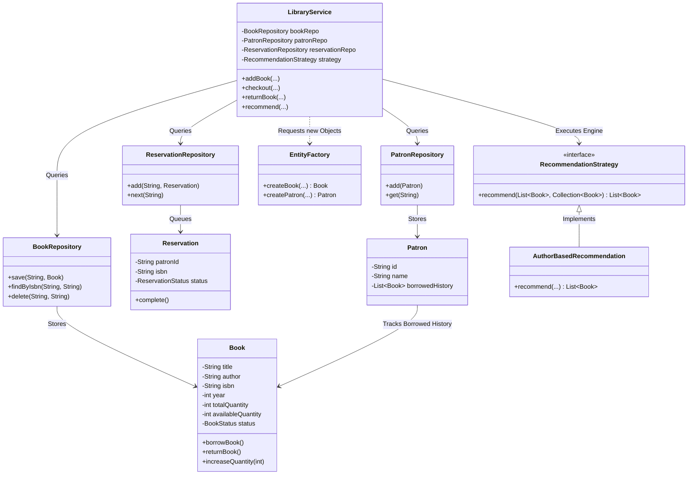

# Library Management System

This project is a complete Java implementation of a Library Management System built to rigorously follow Object-Oriented Programming (OOP) concepts, SOLID principles, and clean system design. 

## 1. System Overview & Core Features

### Book & Patron Management
At the core of the system, we handle the fundamental entities: **Books** and **Patrons**. The system securely tracks properties for books (like title, author, and ISBN) and dynamically manages how many copies are available in real-time. Patrons (library members) are tracked along with the history of all the books they have borrowed.

### Lending & Inventory Processes
The system features a robust checkout and return process. Whenever a book is checked out, the total available inventory of that book is safely decremented. If a book is completely checked out, the system prevents further checkouts and instead utilizes the reservation queue. When a book is returned, the inventory increments back up safely.

### Advanced Features (Extensions Built)
- **Multi-Branch Support:** The system is heavily mapped around Branch IDs. Books and Patrons belong to specific branches, and you can securely transfer books from Branch A to Branch B without losing inventory counts.
- **Reservation System (FIFO):** If a book is out of stock, patrons are added to a waiting list (Queue). When the book is returned, the system automatically checks the waitlist and triggers a notification for the next patron in line.
- **Recommendation Strategy:** By analyzing what a specific patron has historically borrowed, the system searches the available catalog and recommends similar books based on author matches.

---

## 2. Technical Architecture & Design Patterns

The architecture is broken down to strictly separate out data, logic, and entity models so the code doesn't become a tangled mess (Single Responsibility Principle). I utilized the following specific Design Patterns to solve complex problems:

### **Design Pattern 1: Factory Pattern**
Instead of having the main service directly handle the memory allocation and instantiation of core subjects, I built an `EntityFactory`. The `EntityFactory` centralizes exactly how `Book` and `Patron` objects are created. If we ever need to add complex logic to how a Book is built (like fetching an external API for the cover), we only update the Factory without touching the core library logic.

### **Design Pattern 2: Strategy Pattern**
The brief required a recommendation engine. Instead of hardcoding exactly how a book is recommended into the library, I created a `RecommendationStrategy` interface. The system currently uses the `AuthorBasedRecommendation` strategy under the hood. This solves the Open/Closed Principle: if we ever want to add genre-based recommendations later, we just plug in a new strategy without modifying any core library service code!

---

## 3. Class Relationships & Architecture Diagram

Because keeping track of how all these pieces communicate is important, here is a detailed breakdown of how the classes relate to one another:

**The Core Application Flow:**
1. **`Main.java`** is the entry point. It holds the interactive CLI terminal and passes user commands directly to the `LibraryService`.
2. **`LibraryService` (The Brain):** This class never stores data directly. Instead, it relies tightly on four distinct Repositories: `BookRepository`, `PatronRepository`, `BranchRepository`, and `ReservationRepository`. 
3. **The Repositories (The Data Layer):** 
   - `BookRepository` maps directly to `Book` entities.
   - `PatronRepository` maps directly to `Patron` entities.
   - `ReservationRepository` manages a specific Java `Queue` mapping to `Reservation` entities.
4. **The Entities:** `Book` and `Patron` act as pure data containers. `Patron` contains a list of `Book` objects to track their past borrow history. 
5. **The Support Classes:** 
   - The `NotificationService` acts as a utility to alert patrons when a `Reservation` is resolved.
   - The `EntityFactory` sits independently, strictly feeding newly created `Book` and `Patron` objects into the flow when the `LibraryService` requests them.

### UML Class Diagram

## How to Run the Application
1. Ensure you have the Java JDK installed.
2. Navigate into the `src/` directory.
3. Simply execute `Main.java`. A terminal-based user interface will guide you through adding branches, books, and testing out the real-time checkouts and reservations!

---

## Overview of the Project
This **Library Management System** serves as a complete demonstration of Low-Level Design (LLD) proficiency. By mapping real-world library operations (managing patrons, checking out books, processing returns, and handling multi-branch transfers) into pure Java Object-Oriented structures, the project effectively showcases how to build scalable and maintainable enterprise software. 

The primary goal was to move beyond simply making the code "work," and instead focus heavily on *how* it was structured. By strictly adhering to **SOLID principles** and deeply integrating industry-standard **Design Patterns** (Strategy and Factory), this project proves the capacity to design complex data relationships and loosely coupled components that can be safely expanded upon in the future without breaking existing application flows.
